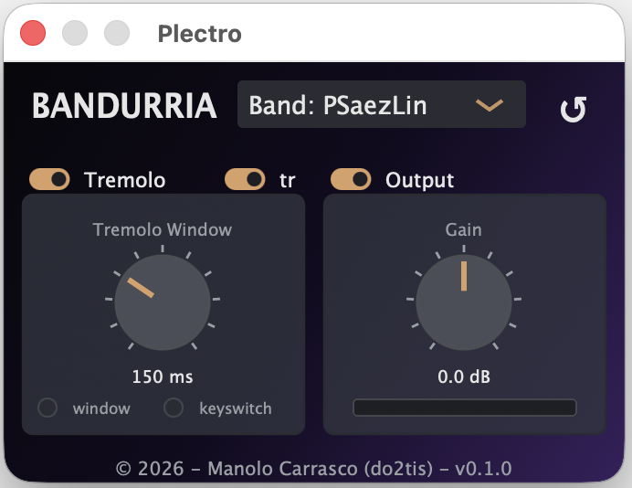

# Plectro VST

A VST3 / AudioUnit **instrument** for the Spanish plucked plectrum family ("pulso y pua":
bandurria, laud). It loads inside MuseScore 4 (or any VST3/AU host) as the sound source for a
staff, plays a bundled SoundFont, and makes the two things MuseScore renders badly on these
instruments, **tremolo** and **trills**, sound like a real player instead of a sequencer. The whole
workflow stays in MuseScore: ordinary tremolo beams and ordinary ornaments, no velocity hacks.

Getting a natural bandurria or laud tremolo in MuseScore used to be a chore. The previous approach,
the [Pulso y Pua](https://musescore.org/en/project/pulso-y-pua-tremolo-and-soundfont-manager)
plugin had to encode the tremolo in each note's MIDI velocity and disable the
playback of tremolo symbols, tied notes, dynamics, articulations, ornaments and dynamics that would break
that velocity trick, and you had to run it again every time the music changed. Plectro VST3 needs none of
that. It reads the notation live, so you keep your real dynamics and ornaments and never touch
velocity.


## Demo


https://github.com/user-attachments/assets/d7f77d2e-9ad2-49f1-9272-37fafd08bdf1


The demo is recorded in MuseScore, switching a score's staves from the Muse Sounds "Acoustic Steel
Guitar" to Plectro's Bandurria and Laud: the sound changes to a real plucked instrument, and the
tremolos change from a machine gun of repeated notes to a natural one. In any other VST3 / AU host
the process is similar: load Plectro on the track and write ordinary tremolos.

## Usage



- **Instrument selector** (top): pick the instrument bank; the reset button (top right) restores the defaults.
- **Tremolo:** turns the host's measured tremolo into one sustained voice. **Tremolo Window** sets how wide a repeated note burst still counts as one tremolo, and **tr** also captures trills and ornaments as a single tremolo. The **window** and **keyswitch** LEDs light for the source driving the current tremolo.
- **Output:** the output stage. **Gain** sets the level, with the peak meter below it.

## Tremolo, two techniques

A notation host renders a measured tremolo as a rapid burst of repeated note ons. Plectro turns that
back into one sustained tremolo voice instead of a machine gun of retriggers, and it supports **two**
ways to know a note is a tremolo, using whichever the host allows:

- **Automatic detection.** Plectro detects the repeated note burst itself, within a configurable
  window, and collapses it into one tremolo. It needs no setup and works in any host, so it is the
  fallback wherever a host does not send keyswitches.
- **Keyswitches (the optimal path).** Plectro advertises its articulations as VST3 keyswitches
  (`IKeyswitchController`), so a host that supports them selects the articulation explicitly and
  unambiguously, and automatic detection is not needed. Not every host sends keyswitches to
  instrument plugins: MuseScore does not in a released version yet, with the change proposed upstream
  in [muse_framework#183](https://github.com/musescore/muse_framework/pull/183).

Because tremolo no longer has to be encoded in velocity, the host's hairpins and dynamics flow
through as real loudness.

## Trills and ornaments

A host also expands a trill (and mordents and turns) into a rapid alternation of note ons, which
on a bandurria or laud sounds mechanical. With **Capture Trills** on, Plectro keeps only the main
note and renders the ornament as a single sustained tremolo, so a trilled long note sounds like a
tremolo roll on the written pitch instead of a stuttering two note trill. Turn it off to hear the
ornament as written notes.

## Articulations across hosts

Plectro selects its playing techniques (pizzicato, tremolo, harmonic, mute, legato) through
**keyswitches**: reserved low MIDI notes (0 to 12) that pick an articulation instead of sounding a
pitch. There is no universal keyswitch standard, so Plectro publishes one stable map and never
changes the note numbers, keeping saved projects working. The map is generated from a single source
of truth, `articulations/plectro-articulations.json`, by `tools/generate_articulation_maps.py`.

Hosts reach that map in one of three ways:

- **Auto discovery.** The host queries the plugin over VST3 `IKeyswitchController` and configures
  itself. Cubase, Dorico and the MuseScore fork work this way.
- **Official map file.** The host imports a file Plectro ships, under `generated/`:
  `logic/Plectro.plist` (Logic Pro Articulation Set), `cubase/Plectro.expressionmap` (Cubase
  Expression Map), `dorico/Plectro.doricolib` (Dorico library), and `generic/Plectro-articulations.json`
  (a neutral map for any tool).
- **Manual MIDI notes.** In hosts without either, place the keyswitch notes by hand.

| Host | Format | How articulations arrive |
|:-----|:-------|:-------------------------|
| Cubase | VST3 | Auto discovery, or the bundled Expression Map |
| Dorico | VST3 | Auto discovery, the `.doricolib`, or the Cubase map |
| Logic Pro | Audio Unit | Bundled Articulation Set (`.plist`) |
| GarageBand (macOS) | Audio Unit | Manual keyswitch notes |
| GarageBand (iOS) | AUv3 | Not supported yet (future work) |
| MuseScore (fork) | VST3 | Auto discovery |
| REAPER, Ableton Live, others | VST3/AU | Manual keyswitch notes |

The MIDI number is the reference; hosts label MIDI 0 as C-1 (Cubase, Dorico, MuseScore) or C-2
(Logic, GarageBand). Full per host instructions, the complete map and a manual smoke test are in
[docs/articulations.md](docs/articulations.md).

## Full support in MuseScore

Plectro runs in any VST3 / AU host today, and in MuseScore it plays out of the box through automatic
detection. Two changes to MuseScore's audio framework remove the remaining workarounds and let it
drive Plectro straight from the notation. Both are proposed upstream; until they ship in a MuseScore
release, Plectro falls back to a less exact path:

- **Keyswitch delivery** ([muse_framework#183](https://github.com/musescore/muse_framework/pull/183)):
  MuseScore tells the plugin each note's articulation explicitly (pizzicato, tremolo, mute, harmonic,
  legato) through `IKeyswitchController`, instead of Plectro inferring it from repeated note bursts.
  Fallback: automatic detection, which cannot always tell an ornament from a tremolo.
- **Layered articulation dynamics**
  ([muse_framework#179](https://github.com/musescore/muse_framework/pull/179)): fixes slurred
  tremolos and slurred grace notes playing back silently in MuseScore 5.0, so those passages sound at
  their real dynamic. Without it the only workaround is to not slur them.

Both changes are no-ops for other instruments and for the FluidSynth and MuseSampler backends. With
them merged, MuseScore drives Plectro from ordinary notation with no hacks or workarounds.

## Sound

The sound comes from a SoundFont played by an embedded FluidSynth, so the font's envelopes, filter,
LFOs and looped tremolo layers are reproduced exactly. Each instrument bank carries its
articulations as named presets (base pick, tremolo, picked tremolo attack, and where present mute,
pizzicato and harmonic), selected by name at load time.

The tremolo is not synthesized from repeated notes: it is a real recording of the instrument played
by a skilled performer, so it has the natural beating (strum) rate and the human dynamics of an
actual tremolo. A sustained tremolo sounds like a player, not the machine gun of retriggered MIDI
notes that MuseScore produces on its own.

The bundled font ships **bandurria** and **laud**.


## Architecture

```
MuseScore (normal tremolo beams + normal ornaments + normal dynamics)
  -> note events (plus keyswitches once a host sends them)
  -> Plectro:
       streaming buffer
       -> articulation (automatic tremolo/trill detection, or a host keyswitch)
       -> note variation
       -> FluidSynth (the SoundFont: pick vs tremolo vs ...)
  -> audio -> host mixer
```

The articulation, detection and streaming logic live in a JUCE free, unit tested static library
(`plectro_core`); the plugin is a thin JUCE wrapper plus a FluidSynth adapter.

## Install

Download the bundle for your format from the [Releases](../../releases) tab and unzip it. Move it
into your plugin folder, then restart your host:

- macOS VST3: `~/Library/Audio/Plug-Ins/VST3/`
- macOS AU: `~/Library/Audio/Plug-Ins/Components/`
- Windows VST3: `C:\Program Files\Common Files\VST3\`

The bundles are **not code signed or notarized**, so your system blocks them the first time and you
have to allow them by hand, once:

- **macOS:** right click the plugin in Finder and choose **Open**, or clear the quarantine flag from a
  terminal with `xattr -dr com.apple.quarantine "<the plugin bundle>"`. If your host still does not
  list it, allow it in **System Settings > Privacy & Security**.
- **Windows:** on the SmartScreen warning choose **More info > Run anyway**.

## Use in MuseScore 4

1. Open the Mixer (F10), pick the bandurria/laud staff, and set its sound to **Plectro**.
2. Write ordinary tremolo beams on long notes, ordinary trills and ordinary dynamics. The old
   velocity hack and tied note muting are not needed.

## Parameters

Master gain; tremolo (enable, detection window, capture trills); output enable.

## Development

Build from source. Requirements: CMake 3.22+, a C++20 compiler, and (for sound) FluidSynth.

```sh
# macOS
brew install fluid-synth pkg-config
cmake -B build -DCMAKE_BUILD_TYPE=Release
cmake --build build --config Release
ctest --test-dir build --output-on-failure   # runs the core unit tests
```

Without FluidSynth the plugin still builds, but silent (handy for CI smoke builds). The
`plectro_core` tests never need JUCE or FluidSynth, so they are fast:

```sh
cmake -B build -DHVST_BUILD_PLUGIN=OFF
cmake --build build --target core_tests
ctest --test-dir build --output-on-failure
```

To run a local build, copy the freshly built bundle from `build/` into the plugin folder listed
under Install. A bundle you built yourself is not quarantined, so the unsigned first open steps above
do not apply to it.

## License

See `LICENSE`.
